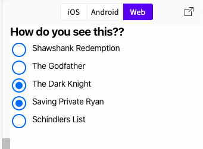

# React Native Radio Button

Simple Radio and RadioGroup button for React Native App which supplort single select and multiple select.

## Installation

using npm

```
npm i @pratap2210/react-native-radio-button
```

using yarn

```
yarn add @pratap2210/react-native-radio-button
```

## Usage

This is format of input

```jsx
      radioGroups: [
        {
          label: 'Shawshank Redemption',
          uniqueId: 'shawshankRedemption',
        },
        {
          label: 'The Godfather',
          uniqueId: 'theGodfather',
        },
        {
          label: 'The Dark Knight',
          uniqueId: 'theDarkKnight',
        },
        {
          label: 'Saving Private Ryan',
          uniqueId: 'savingPrivateRyan',
        },
        {
          label: 'Schindlers List',
          uniqueId: 'schindlersList',
        },
      ]
        <RadioButtonGroup radioButtons={radioGroups} radioGroupLabel={`How do you see this??`} onRadioGroupChange={this.handleRadioGroupChange} isMultiSelect={false}/>

```

```js
handleRadioGroupChange = updatedRadioGroups => {
  console.warn("Updated Groups ", updatedRadioGroups);
  this.setState({
    radioGroups: updatedRadioGroups
  });
};
```

### Outputs

Output if multiple is false


```js
[{label:"Shawshank Redemption",uniqueId:"shawshankRedemption",selected:false},
{label:"The Godfather",uniqueId:"theGodfather",selected:false},
{label:"The Dark Knight",uniqueId:"theDarkKnight",selected:true},
{label:"Saving Private Ryan",uniqueId:"savingPrivateRyan",selected:false},
{label:"Schindlers List",uniqueId:"schindlersList",selected:false}}
```

Output if multiple is true



```js
[
  { label: "Shawshank Redemption", uniqueId: "shawshankRedemption" },
  { label: "The Godfather", uniqueId: "theGodfather", selected: false },
  { label: "The Dark Knight", uniqueId: "theDarkKnight", selected: true },
  {
    label: "Saving Private Ryan",
    uniqueId: "savingPrivateRyan",
    selected: true
  },
  { label: "Schindlers List", uniqueId: "schindlersList" }
];
```

### Configuration

##### Radio Group:

| Property             | Type         | Default   | Description                                                     |
| -------------------- | ------------ | --------- | --------------------------------------------------------------- |
| size                 | number       | 24        | Size of the radio button                                        |
| thickness            | number       | 2         | width of radio button border                                    |
| color                | string       | '#007AFF' | color of radio button                                           |
| isMultiSelect        | boolean      | false     | is radio button multiple selectable                             |
| radioGroupLabel      | string       | null      | Label for the Radio group                                       |
| radioGroupLabelStyle | object       | null      | Custom styles to be applied if supplied                         |
| radioLabelStyle      | object       | null      | Custom styles to be applied if supplied                         |
| radioStyle           | object       | null      | Custom styles to be applied if supplied                         |
| style                | object       | null      | Custom styles to be applied if supplied                         |
| onRadioGroupChange   | updatedValue | null      | function to be invoked when radio button is selected or changed |

### Motivated from

[How to implement radio button in React Native](https://stackoverflow.com/a/36229563/10398005)

[Checkbox in react by Harshal](https://github.com/patilharsh555/harshalpublic)

[react-native-flexi-radio-button](https://github.com/thegamenicorus/react-native-flexi-radio-button)
